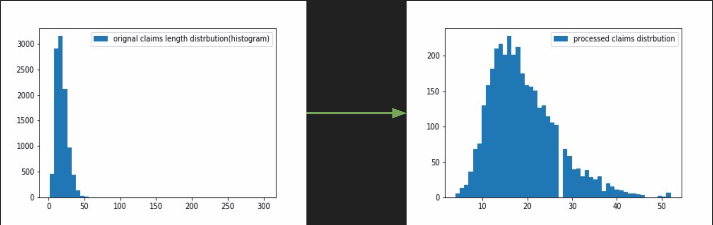
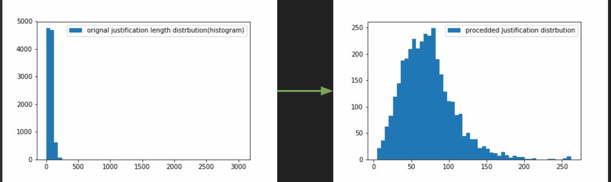
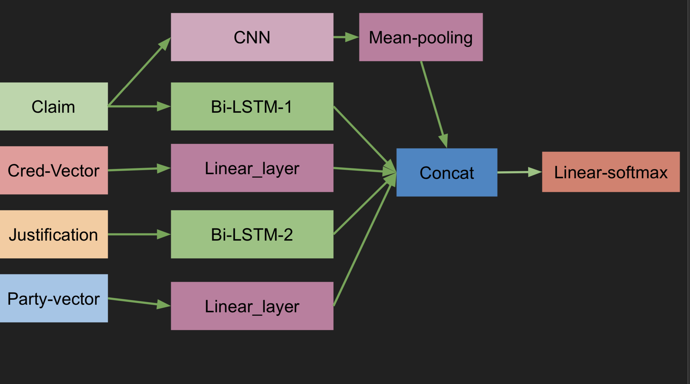

# Fake News Detection
A model for detecting fake news using the Liar-Plus dataset.

# The Code
The following section contains information about navigating and running the code. 
### Requirements
  * Numpy
  * Pandas
  * sklearn
  * Pytorch
  * Matplotlib
  * Gensim

  ### Running the Code
The code is split into three files `preprocess.py`, `six_train.py`, `binary_train.py`.

Note: Running preprocess.py requires Google wordtovec which is ~3GB in size. For convenience I have stored the output in the repo. The user does not have to run this file. 

The file six_train.py contains the code for the six-way classifier. Running this file will do the following:
  1. Set up the model and train it for 20 epochs.
  2. Pick out the best model automatically using the F1 score of the validation dataset.
  3. Apply the best model on the dataset.

Running this code with GPU support is recommended.


The file binary_train.py contains the code for the binary classifier. Running this file will do the same as six_train.py but for the binary classifier. 

Note: If you get a warning for the F1 score, you can safely ignore it. The reason for this warning is that the model is not outputting all the categories yet which are necessary for computing the F1 score.

### The Models
The two folders, `six_way_model` and `binary_model` contain the models produced. This is done to maintain accountability. The models can be easily extracted using `torch.load()` for testing.

### The Jupyter Notebooks
The original code was written in Jupyter notebooks which are included for reference.


# The Theory and Research
### The Scores
  In the paper provided, the results are in terms of F1 score. The models I trained show significant improvement in terms of F1 score while also showing a slight increase in Binary classification. The results are shown in the tables below.
  
  #### Binary Classification
| Model    | F1    |      | Accuracy |      |
|----------|-------|------|----------|------|
|          | Valid | Test | Valid    | Test |
| My Model | .772  | .727 | .77      | .72  |
| S + MJ   | .70   | .70  | -        | -    |

  #### Six-Way Classification
| Model    | F1    |      | Accuracy |      |
|----------|-------|------|----------|------|
|          | Valid | Test | Valid    | Test |
| My Model | .47   | .461 | .56      | .485 |
| S + MJ   | .37   | .36  | -        | -    |

### Pre-Processing
The information inputted to the neural network is:
  * The claim
  * The justification
  * Party Affiliation
  * Credibility of the speaker
 
 ### Processing
 #### Claim, Justification and Party Affiliation
  These sentences are tokenized word by word and the frequency of each word is recorded. For example, the word “politifact” is repeated 123 times in the database. Google wordtovector is used for obtaining pretrained vectors(300 dimensional).
So that each word is assigned a 300 dimensional vector. If a word is not found in wordtovec, its frequency is checked. If the frequency is greater than a set value then a randomly sampled 300 dimensional vector is assigned to it. Otherwise it is simply labeled as <unk> If the sentence length is larger that a set value the <unk> is omitted. Resulting
in better training data.

```
"congress" ====WordToVec====> '300 dimensional vector'
```





#### Credibility
  The credit history includes the historical counts of inaccurate statements for each speaker. For example, Mitt Romney has a credit history vector h = {19, 32, 34, 58, 33}, which corresponds to his counts of “pants on fire”, “false”, “barely true”, “half true”, “mostly true”. This vector is normalized by dividing each element by the total sum. 
 
 
 ### The model
 
 
 The p-BiLSTM model mentioned in the paper was used as the base line model. In addition, a CNN is also used to extract additional information from the claims. Metadata extracted is passed through linear layer. Outputs are concatenated and passed through a linear softmax layer. I believe that the CNN model will help extract something similar to the sentiment of
the claim. The same model is used for both Six-way and Binary classification. The only difference being in softmax layer.

#### Loss and Evaluation
  Both six-way and binary models are trained using cross entropy loss. The F1 score and the accuracy are used for evaluation. These metrics were computed using sklearn. 
  
#### Removing Bi-LSTM1 
  I experimented by removing Bi-LSTM1 and using only a CNN to extract features from the claim. The resulting drop was very marginal compared to the speed which CNN provides. Indicating that CNN can perform well on this dataset for classification.
  
#### Other Ideas
  I tried chaining 6 multi headed attention driven transformer instead of Bi-LSTMs as they usually perform well in classification tasks but in this case it did not improve the result significantly. I also tried using "BERT" instead of wordtovec but this could not be completed given the time crunch.

## Citations
  Google wordtovec was used in the research, everything else is original. 
 
 
